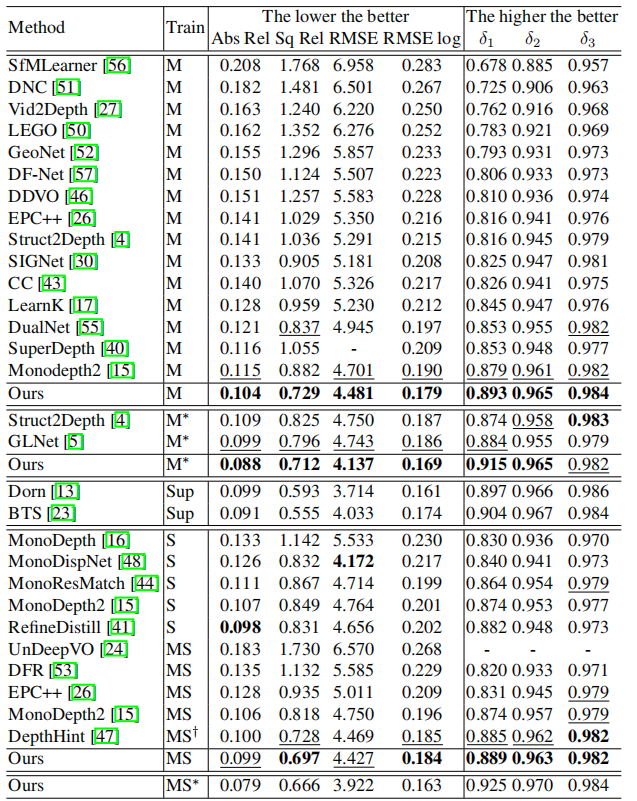

# feature_metric_depth
Offical codes for ECCV2020 paper --- ['Feature-metric Loss for Self-supervised Learning of Depth and Egomotion'](https://arxiv.org/pdf/2007.10603.pdf).

<p align="center">
  
</p>

If you find our work useful in your research please consider citing our paper:

```
@article{shu2020featdepth,
  title={Feature-metric Loss for Self-supervised Learning of Depth and Egomotion},
  author={Shu, Chang and Yu, Kun and Duan, Zhixiang and Yang, Kuiyuan},
  booktitle={ECCV},
  year={2020}
}
```

## Setup
Our codes are based on mmcv for distributed learning.
To make it convenient for you to train and test our codes, we provide our [anaconda environment](https://drive.google.com/file/d/1NSoGxhP8UpyW-whzpqP3WIB6u2mgGP49/view?usp=sharing), 
you only need to download it and extract it to the folder of your anaconda environments, and use the python in it to run our codes.
Besides, a computer installed with CUDA10 is required.

## KITTI training data

Our training data is the same with other self-supervised monocular depth estimation methods, please refer to [monodepth2](https://github.com/nianticlabs/monodepth2) to prepare the training data.

## pretrained weights

We provide weights for [autoencoder](https://drive.google.com/file/d/1ncAWUMvLq2ETMpG-7eI9qfILce_cPPfy/view?usp=sharing), [our model trained on kitti raw data](https://drive.google.com/file/d/1HlAubfuja5nBKpfNU3fQs-3m3Zaiu9RI/view?usp=sharing), 
[our refined model by using online refinement on test split of kitti raw data](https://drive.google.com/file/d/1CfCtz55s4QHya3y3UslxsuD_0cxNlA-D/view?usp=sharing) , [our model train on kitti odometry](https://drive.google.com/file/d/1vQJbiyPXv_XNQYpyVocDB3-LKwx2LVka/view?usp=sharing), 
[our model trained on Euroc](https://drive.google.com/file/d/1IMIAKpHXmqyUxiUIiqqp5qI-nJXDUSmj/view?usp=sharing), and [our model trained on NYU](https://drive.google.com/file/d/1Mo050P-DgG-jrNXWww07GXXyst5h5Q74/view?usp=sharing).

## Configurations
Our provide a variety of config files for training on different datasets.
They are stored in config folder.

## API
We provide an API interface for you to predict depth and pose from an image sequence and visulize some results.
They are stored in folder 'scripts'.

## Training
You can use following command to launch distributed learning of our model:
```shell
/path/to/python -m torch.distributed.launch --master_port=9900 --nproc_per_node=1 train.py --config /path/to/cfg_kitti_fm.py --work_dir /path/to/dir/for/saving/weights/and/logs'
```
Here nproc_per_node refers to GPU number you want to use.
We provide a different configuration for different perferrence.
For example, 'cfg_kitti_fm.py' is used to train our model on kitti dataset, where the weights of autoencoder are loaded from the pretrained weights we provide and fixed during the traing. 
This mode is prefered when your GPU memory is lower than 16 GB;
'cfg_kitti_fm_joint.spy' is used to train our model on kitti dataset, where the autoencoder is jointly trained with depthnet and posenet.
And we rescale the input resolution of our model to ensure training with 12 GB GPU memory, slightly reducing the performance.
You can modify the input resolution according to your computational resource.

## Finetuning
If you want to finetune on a given weights, we can modify the 'resume_from' term from 'None' to an existing path to a pre-trained weight in the config files.

## Notes
Our model predicts inverse depths.
If you want to get real depth when training stereo model, you have to convert inverse depth to depth, and then multiply it by 36.
